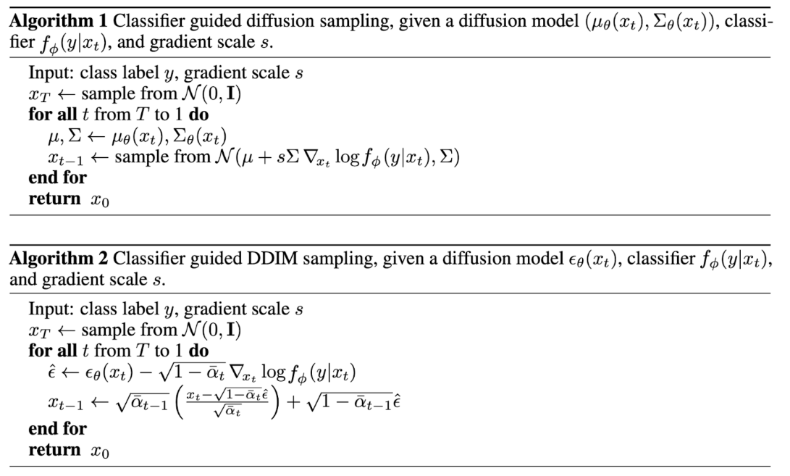

+++
title = 'Guided Diffusion'
date = 2022-07-06
author= ["Mehdi Azad"]
summary = "summary"
+++

# Conditioned Generation

condtional generation =  guided diffusion = guidence

recall $p(x_{0:T}) = p(x_{T})\prod_{t=1}^{T}p(x_{t-1}|x_{t})$

then conditional diffusion model is defined as: 

$$
p(x_{0:T}) = p(x_{T})\prod_{t=1}^{T}p(x_{t-1}|x_{t},y)
$$

y could be text encoding in image-text generation or a low-resolusion image to perform super-resolution on. 

We train the diffusion model to predict $\epsilon_{\theta}(x_{t},t,y) \approx \epsilon_{0}$ or $s_{\theta}(x_{t},t,y) \approx \nabla \log p(x|y)$

# Guidance

What is guidance?

a process by which the model predictions at each step in the generation process are evaluated against some guidance function and modified such that the final generated image is more to our liking.

why guidance when we can use conditioned generation?

1. By just adding the labe $y$ to the input, the model may learn to ignore or downplay any conditioning information. Guidence is proposed to more explicitly control the amount of weight the model gives to conditioning information at the cost of sample diversity. 
2. When we train unconditional model but we want to use it for conditional generation. We'll take an existing model and steer the generation process at inference time for additional control
3. For generation after fine tuning an existing model. After re-training a model with new data the generated output is something between main dataset and new data set. By using guidance we can have more control over generating process to have more desirabel outputs.

## Classifier Guidance

Let us start with score-base formulation of a diffusion models. 

$$
\nabla_{x}\log p(x)= \nabla_{x}(-\frac{1}{2\sigma^{2}}(x-\mu)^2)=-\frac{x-\mu}{\sigma^2}=-\frac{\epsilon}{\sigma}
$$

Knowing this, then we can write: 

$$
\begin{aligned}
s_{\theta}(x_{t},t) = \nabla_{x_{t}}\log q(x_{t})&=E_{q(x_{0})}[\nabla_{x_{t}}\log q(x_{t}|x_{0})] \\\\
&=E_{q(x_{0})}[-\frac{\epsilon_{\theta}(x_{t},t)}{\sqrt{1-\bar\alpha_{t}}}]\\\\
&=-\color{cyan} \frac{\epsilon_{\theta}(x_{t},t)}{\sqrt{1-\bar\alpha_{t}}}
\end{aligned}
$$

for conditonal case the score function is defined as: $\nabla \log q(x_{t},y)$

$$
\nabla \log q(x_{t},y) =\nabla \log q(x_{t}) +\nabla \log q(y|x_{t}) = -\frac{\epsilon_{\theta}(x_{t},t)}{\sqrt{1-\bar\alpha_{t}}}+\nabla_{x_{t}} \log q(y|x_{t})
$$

we can approximate the term $\nabla \log q(y|x_{t})$ by training a classifier $f_{\phi}(y|x)$ on noisy data $x_{t}$. So, we can continue the math above:

 

$$
\begin{aligned}
... &= -\frac{\epsilon_{\theta}(x_{t},t)}{\sqrt{1-\bar\alpha_{t}}}+\nabla_{x_{t}} \log q(y|x_{t})\\\\
 &\approx -\frac{\epsilon_{\theta}(x_{t},t)}{\sqrt{1-\bar\alpha_{t}}}+\nabla_{x_{t}} f_{\phi}(y|x_{t}) \\\\
&= \color{cyan} - \frac{1}{\sqrt{1 - \bar \alpha_{t}}}(\epsilon_{\theta}(x_{t}, t) -  \sqrt{1 - \bar \alpha_{t}}\nabla_{x_{t}} f_{\phi}(y|x_{t}))
\end{aligned}
$$

so, inorder to guid the sampling process towards the conditioning information y we need to alter the noise prediction by a term comming from gradient of the classifier. we defined this altered prediction as $\bar\epsilon_{t}(x_{t},t)$

$$
\bar\epsilon_{t}(x_{t},t)=\epsilon_{\theta}(x_{t}, t) -  \sqrt{1 - \bar \alpha_{t}}\omega \nabla_{x_{t}} f_{\phi}(y|x_{t})
$$

the term $\omega$ is added to control the strength of the clssifier guidance. 

## Classifier-Free Guidance

A conditional diffusion model $p_{\theta}(x|y)$ is trained on paired data $(x,y)$, where the conditioning information $y$ gets discarded periodically at random such that the model knows how to generate images unconditionally as well, i.e. $\epsilon_{\theta}(x, t) = \epsilon_{\theta}(x, t, y=\varnothing)$. 

Given,

$$
\begin{aligned}
\nabla_{x_{t}}\log(y|x_{t})&= \nabla_{x_{t}}\log(x_{t}|y)- \nabla_{x_{t}} \log p(x_{t}) \\\\
&=-\frac{1}{\sqrt{1-\bar \alpha_{t}}}(\epsilon_{\theta}(x_{t}, t,y)-\epsilon_{\theta}(x_{t},t))
\end{aligned}
$$

Then,

$$
\begin{aligned}
\bar\epsilon_{t}(x_{t},t,y)&=\epsilon_{\theta}(x_{t}, t,y) -  \sqrt{1 - \bar \alpha_{t}}\omega \nabla_{x_{t}} f_{\phi}(y|x_{t}) \\\\
&=\epsilon_{\theta}(x_{t}, t,y)+\omega(\epsilon_{\theta}(x_{t}, t,y)-\epsilon_{\theta}(x_{t}, t)) \\\\
&=(\omega+1)\epsilon_{\theta}(x_{t}, t,y)-\omega \epsilon_{\theta}(x_{t}, t)
\end{aligned}
$$

So, the same model is trained to make predictions with or without a conditioning prompt as an input. At each step of the denoising process, the model is run twice: once with the prompt and once without the prompt. The prediction without the prompt is subtracted from the prediction with the prompt, which removes the details generated without the prompt, leaving only the details that come from the prompt. This leads to a generation that more closely follows the prompt [6]. 

## CLIP Guidance

TBD

# Stable Diffusion

TBD

<!-- # Summary

Diffusion models are a type of generative model that learn to denoise images by iteratively applying a random diffusion process. The model is trained to predict the original image from the noisy output of the diffusion process. The intuition and math behind diffusion models are explained, including the different interpretations of the reverse process, training a diffusion model, and conditioned generation. Guidance methods, including classifier guidance and CLIP guidance, are also discussed. Stable diffusion is introduced as a way to improve the stability of the diffusion process during training. -->

# References

[1] Weng, Lilian. (Jul 2021). What are diffusion models? Lil’Log. [https://lilianweng.github.io/posts/2021-07-11-diffusion-models/](https://lilianweng.github.io/posts/2021-07-11-diffusion-models/)

[2] Calvin, Luo. (Aug 2022). Understanding Diffusion Models: A Unified Perspective. arxiv Preprint [arXiv:2208.11970](https://arxiv.org/abs/2208.11970)

[3] Yang, Song, Generative Modeling by Estimating Gradients of the Data Distribution.[https://yang-song.net/blog/2021/score/](https://yang-song.net/blog/2021/score/)

[4] Hugging Face Diffusion Models Course, [https://github.com/huggingface/diffusion-models-class](https://github.com/huggingface/diffusion-models-class)

[5] DeepLearning.AI, How Diffusion Model Work.

[6] Why does diffusion work better than auto-regression? [https://www.youtube.com/watch?v=zc5NTeJbk-k](https://www.youtube.com/watch?v=zc5NTeJbk-k)