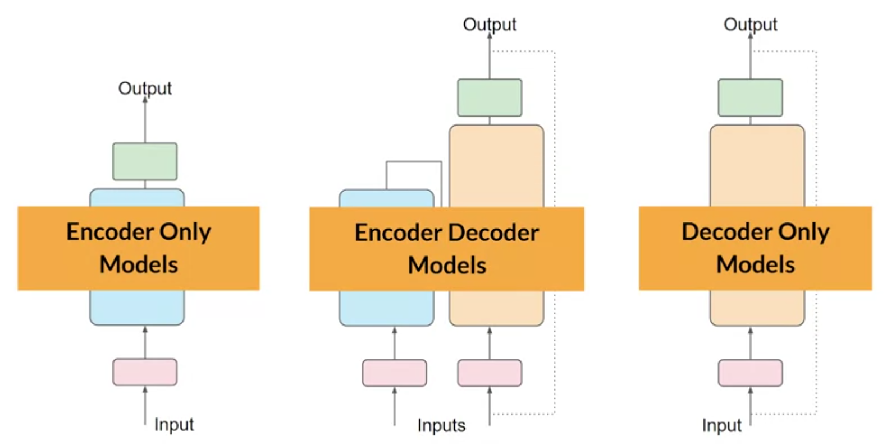
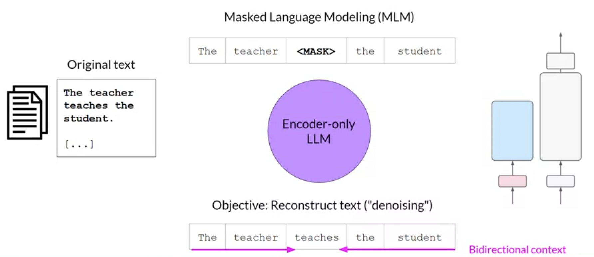
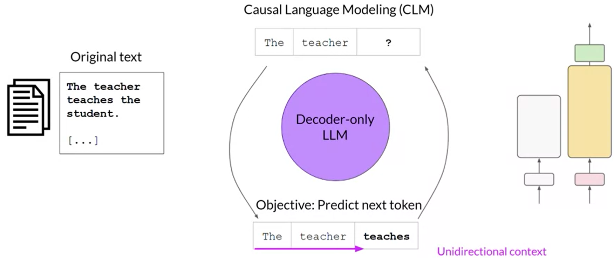
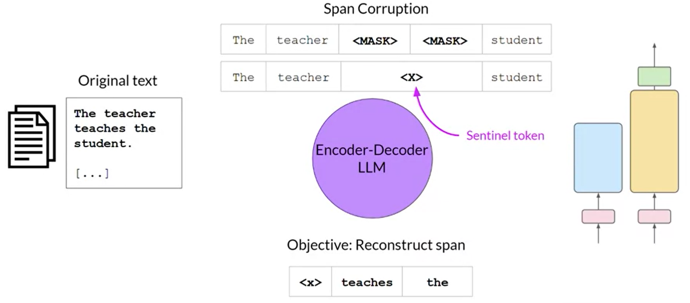
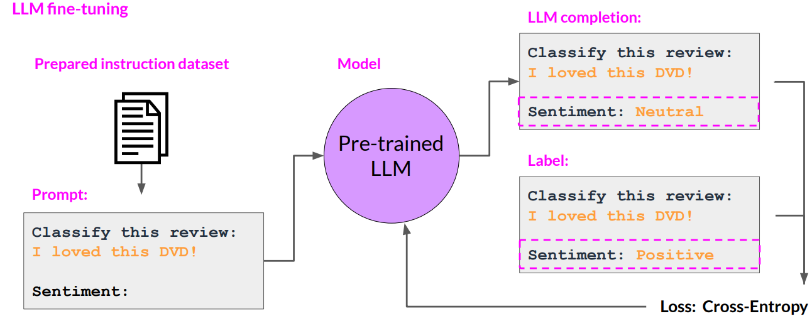

+++
title = 'LLMs' (Un)supervised Learning'
date = 2024-06-14
author= ["Mehdi Azad"]
summary = "Which part of LLMs is trained in an unsupervised manner and which part uses supervised learning?"
+++

# Introduction

LLMs are trained in both supervised and unsupervised manners. The output of unsupervised training are models known as foundation models. These models can later be fine-tuned in a supervised manner to perform more specific tasks. The main unsupervised tasks are: (1) Masked Language Modeling (MLM), where the training objective is to predict the masked tokens in order to reconstruct the original sentence, and (2) Causal Language Modeling (CLM), where the objective is to predict the next token based on the previous sequence of tokens.

Having the foundation models trained in these unsupervised tasks, we can perform more specific tasks such as summarization or translation by using a labeled dataset and updating the foundation models by comparing the model's output to the ground truth labels.

# Pre-training is an unsupervised learning process

Although unsupervised tasks are dedicated tasks in themselves, their main purpose is to facilitate ***understanding of language*** from vast amounts of data and internalize the patterns and structures present in the language. 

The models trained in this manner, also known as ***foundation models***, can be used later to perform supervised tasks through fine-tuning or transfer learning.

The unsupervised tasks defined for models depend on their architecture. In the following sections, different model architectures are listed and the tasks associated with each architecture are discussed.

## Transformer model variants

There are three variants of the transformer model;

 

- Encoder-only models = Autoencoding models
- Decoder-only models =  Autoregressive models
- Encoder-decoder models = Sequence-to-sequence models

As I mentioned in the pervious section, each of these variants learns to carry out different self-supervised tasks

## 1- Masked Language Modeling (MLM)

Masked Language Modeling is a task that involves ***filling in the blanks***, similar to the exercises many of us did in school.

Tokens in the input are randomly masked, and the training objective is to predict the mask tokens in order to reconstruct the original sentence. 

Encoder-only models or Autoencoding models are trained using MLM. 

Example models of encoder-only models are;

- Bert
- Roberta

## 2- Casual Language Modeling (CLM)

The training objective is to ***predict the next token*** based on the previous sequence of tokens.

Decoder-only models or Autoregressive models are trained using CLM.

Example models of decoder-only models are;

- GPT
- BLOOM

## 3- Span Corruption

For the third variation of transformer models, i.e., sequence-to-sequenc models the training objective varies from model to model. 

Example models of encoder-decoder models are; 

- T5
- Bart

For T5 model the  ***sequence*** of the tokens in the input are masked. Those masked sequences are then replaced with a unique Sentinel token, shown here as x.  The pre training objective is reconstructing the mask token sequences auto-regressively.

# Summary of Unsupervised Tasks

# Fine tuning is a supervised learning process

Some of the specific tasks to be done by LLMs are:

- Classification tasks
    - Sentiment analysis
    - Named entity recognition
    - Word classification
- Text generation
- Sequence-to-sequence tasks
    - Translation
    - Question answering
    - Text summarization

We need to fine-tune the foundation models in a supervised manner to perform these tasks.

For example, in the case of Sentiment Analysis:

- We can take an encoder model such as BERT, add a classification head to it, and then train the classifier head.
- Alternatively, we can use an encoder-decoder or decoder-based model to generate Positive/Negative labels autoregressively, as shown below:

# Reference

**Generative AI with Large Language Models**, DeepLearning.AI, lecture notes